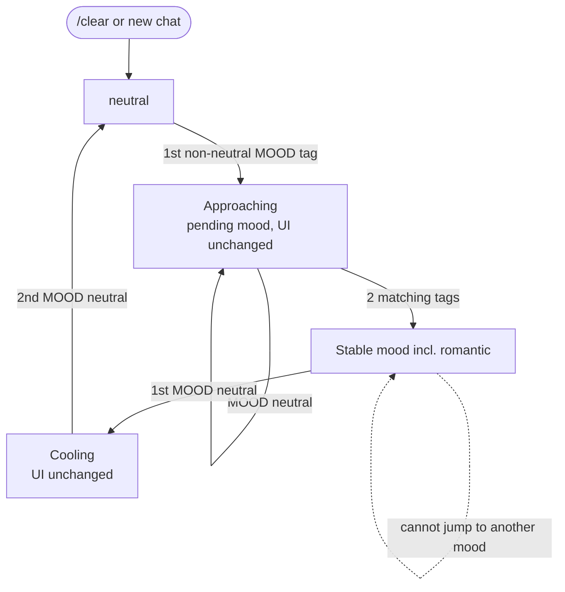

# Tomie

Interactive AI terminal interface built with Next.js and React. Tomie is a character powered by xAI Grok: she replies in a retro terminal UI with distinct moods, each with its own personality, colors, and eye expressions.

## Features

- **Mood-based responses** — Five emotional states with dedicated prompts and visuals
- **Gradual mood transitions** — Approaching / cooling phases; UI changes only when thresholds are met
- **LLM-only mood detection** — No regex or word lists on user input in TypeScript; Grok emits `[MOOD:emotion]` and a state machine counts repeated tags
- **Tone vs tag separation** — Speaking style follows `responseMood`; the tag reflects user input tendency
- **Single API call per message** — One Grok request per user turn (transition system intro when mood changes)
- **Terminal aesthetic** — Typing animation, custom cursor, mood-themed styling, short glitch/interference burst on mood change (~0.5s, plays once)
- **Built-in commands** — `/clear`, `/help`, `/repo`, `/privacy`
- **i18n** — Italian and English (browser language detection)

## Mood states

| Mood | Theme | Typical trigger (via `[MOOD:]` tags) |
|------|-------|--------------------------------------|
| **Neutral** | Blue | Normal chat, factual questions |
| **Angry** | Red | Sustained hostility (2 tags) |
| **Romantic** | Purple | Explicit flirt / love (2 tags, same as other moods) |
| **Excited** | Orange | Enthusiasm (2 tags) |
| **Confused** | Green | Unclear or lost user (2 tags) |

Each mood has unique colors, SVG eyes, and prompt personality definitions in `src/app/services/ai/prompts/`.

## How mood transitions work

Logic lives in [`src/app/core/moodStateMachine.ts`](src/app/core/moodStateMachine.ts). Configuration: `MOOD_TRANSITION_CONFIG`.



| Phase | Visual UI | Behavior |
|-------|-----------|----------|
| **Stable** | Current mood colors/eyes | Normal replies for `currentMood` |
| **Approaching** | Unchanged | Prompt hints at pending mood; `responseMood` stays on current mood |
| **Transition** | Glitch + intro line | Full new personality; `responseMood` switches |
| **Cooling** | Unchanged | Leaving a non-neutral mood toward neutral |

### Thresholds

| Direction | All moods (angry, romantic, excited, confused) |
|-----------|--------------------------------------------------|
| Enter (from neutral) | **2** matching `[MOOD:]` tags (all moods including romantic) |
| Exit (to neutral) | 2 consecutive `[MOOD:neutral]` tags |

**Important:** Progress uses the mood signal from Grok. Each reply includes a `[MOOD:…]` tag; if that tag is `[MOOD:neutral]`, a **second lightweight LLM call** classifies the user message (no regex in TypeScript). Both paths are prompt-driven.

If the UI stays neutral, check `/api/grok` → `detectedMood` in DevTools.

Mismatch handling: a `[MOOD:neutral]` tag while **approaching** freezes progress (no decay). From **stable** neutral, a mismatched tag decays approaching progress slowly.

**Fixing wrong tags:** improve prompts in `src/app/services/ai/prompts/moodPersonalities.ts` (`MOOD_DETECTION_GUIDELINES`) and approaching blocks in `promptGenerator.ts` — not application code heuristics.

### Trying moods manually

After `/clear`, send **two messages in a row** with the same emotional tone. The first starts **approaching** (UI unchanged); the second completes the transition (glitch + new colors).

| Target mood | Example inputs (×2) |
|-------------|---------------------|
| Excited | `WOW!!! INCREDIBILE!!!` then `È FANTASTICO!!!` (×2) |
| Confused | `Non capisco nulla` then `Sono perso, spiegati meglio` (×2) |
| Romantic | 2 explicit messages (e.g. *Ti desidero…* then *Ti amo Tomie*) |
| Angry | Two hostile messages (model must tag `[MOOD:angry]` each time) |

## Environment variables

Create `.env.local`:

```bash
XAI_API_KEY=your_xai_api_key_here
XAI_MODEL=grok-4.20-0309-non-reasoning
```

| Variable | Required | Description |
|----------|----------|-------------|
| `XAI_API_KEY` | Yes | xAI API key from [console.x.ai](https://console.x.ai) |
| `XAI_MODEL` | No | Chat model id (default: `grok-4.20-0309-non-reasoning`) |

If the API returns a model error, set `XAI_MODEL` to a model enabled for your team in the xAI console.

## Getting started

### Prerequisites

- Node.js 18+
- npm

### Installation

```bash
git clone https://github.com/asyntes/tomie.git
cd tomie
npm install
```

Copy env vars into `.env.local` (see above), then:

```bash
npm run dev
```

Open [http://localhost:3000](http://localhost:3000).

## Scripts

| Command | Description |
|---------|-------------|
| `npm run dev` | Dev server (Turbopack) |
| `npm run build` | Production build |
| `npm run start` | Production server |
| `npm run lint` | ESLint |
| `npm test` | Vitest — state machine, mood tag parser, scenarios |
| `npm run test:eval` | Optional LLM-as-judge evals (see below) |
| `npm run test:trace` | Mood transition trace evals (simulated + optional LLM) |

### Optional LLM evals

Integration-style checks with Grok as judge (costs API tokens):

```bash
RUN_LLM_EVALS=1 npm run test:eval
```

Requires `XAI_API_KEY`. Evals live in `src/app/evals/*.eval.ts`.

## Architecture

### Mood pipeline (per user message)

```
TomieTerminal
  → responseHandler.generateFullResponse
      → moodStateMachine.previewTurn(state)     # pick responseMood for this turn
      → POST /api/grok                          # GrokService + PromptGenerator
      → moodDetector.extractMoodFromResponse    # [MOOD:] from reply
      → moodClassifier (if neutral)             # second LLM call on user message
      → moodStateMachine.commitTurn(state, tag)
  → UI: brief interference (~550ms) + setMoodState if shouldChangeMood
```

### Key files

| Path | Role |
|------|------|
| [`src/app/core/moodStateMachine.ts`](src/app/core/moodStateMachine.ts) | Thresholds, approaching/cooling, `previewTurn` / `commitTurn` |
| [`src/app/core/moodSignalResolver.ts`](src/app/core/moodSignalResolver.ts) | Maps model tag → state machine signal (no input parsing) |
| [`src/app/core/responseHandler.ts`](src/app/core/responseHandler.ts) | One fetch per message, intro on transition |
| [`src/app/core/normalizeMoodState.ts`](src/app/core/normalizeMoodState.ts) | Safe state shape after hot reload |
| [`src/app/core/stateManager.ts`](src/app/core/stateManager.ts) | Initial state + thin wrapper over `commitTurn` |
| [`src/app/services/ai/grokService.ts`](src/app/services/ai/grokService.ts) | xAI client, model from env |
| [`src/app/services/ai/promptGenerator.ts`](src/app/services/ai/promptGenerator.ts) | System prompt: `responseMood`, approaching, tag rules |
| [`src/app/services/ai/moodDetector.ts`](src/app/services/ai/moodDetector.ts) | Parse `[MOOD:…]` from character reply |
| [`src/app/services/ai/moodClassifier.ts`](src/app/services/ai/moodClassifier.ts) | Fallback LLM classifier when reply tag is neutral |
| [`src/app/services/ai/prompts/moodPersonalities.ts`](src/app/services/ai/prompts/moodPersonalities.ts) | Personalities + tag guidelines for the model |
| [`src/app/components/TomieTerminal/TomieTerminal.tsx`](src/app/components/TomieTerminal/TomieTerminal.tsx) | UI, typing, mood visuals |

### Tests

| Path | Type |
|------|------|
| `src/app/core/__tests__/moodStateMachine.test.ts` | Unit — thresholds, approaching, decay |
| `src/app/core/__tests__/moodTransitionScenarios.test.ts` | Unit — multi-turn tag sequences |
| `src/app/services/ai/__tests__/moodDetector.test.ts` | Unit — tag parsing |
| `src/app/evals/moodTagging.eval.ts` | LLM — asserts final mood state per user message sequence |

## Commands

- `/clear` — Clear terminal and reset mood state
- `/help` — Command list
- `/repo` — Open GitHub repo
- `/privacy` — Privacy policy

## Technology stack

- Next.js 15 (App Router)
- React 19
- TypeScript
- Tailwind CSS 4
- OpenAI SDK → xAI endpoint (`https://api.x.ai/v1`)
- Vitest
- Custom i18n (`src/app/i18n/`)

## AI prompts (mood detection)

All mood detection is **prompt-driven** (no regex on user input in TypeScript).

| Layer | File | Role |
|-------|------|------|
| Reply tag | `moodDetector.ts` | Parse `[MOOD:…]` from character reply |
| Fallback classifier | `moodClassifier.ts` + `grokService.classifyUserMood` | If reply tag is neutral, one-word LLM classification of user message |
| Tag taxonomy | `moodPersonalities.ts` → `MOOD_DETECTION_GUIDELINES` | Instructs reply tagging |
| Per-turn context | `promptGenerator.ts` | User message + approaching rules |

Run `RUN_LLM_EVALS=1 npm run test:tags` to verify angry / excited / confused / romantic reach the expected UI state (checks **state machine + tags**, not LLM-as-judge on tone).

## Project structure (summary)

```
src/app/
├── api/grok/route.ts          # API route
├── components/TomieTerminal/  # Main UI
├── core/                      # State machine, response handler, mood config
├── services/ai/               # Grok, prompts, mood tag parsing
├── types/                     # Mood, AI, message types
└── i18n/                      # en.json, it.json
```

## License

MIT License